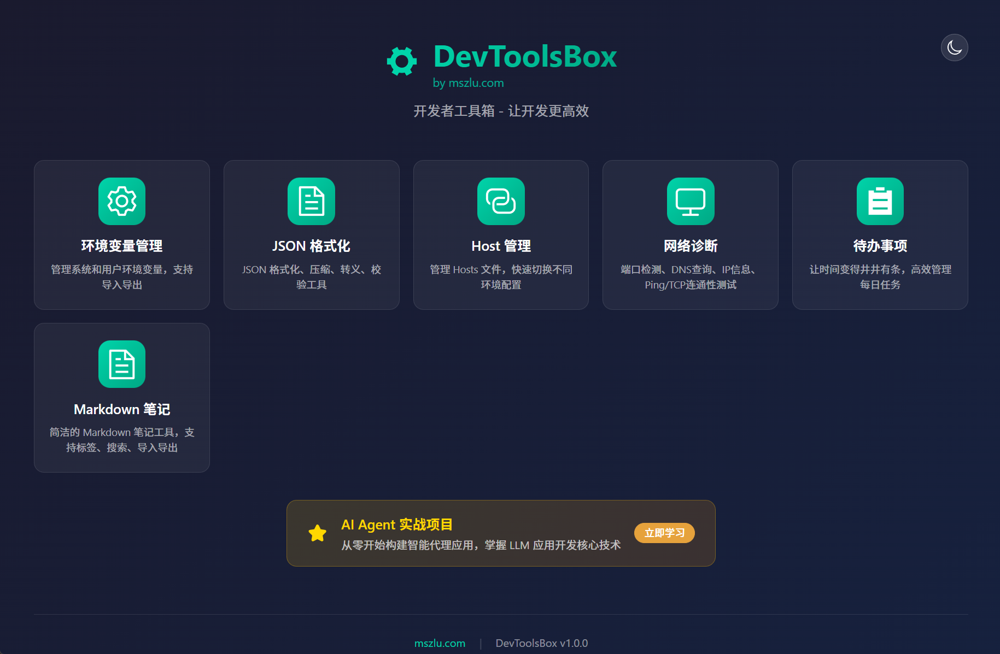
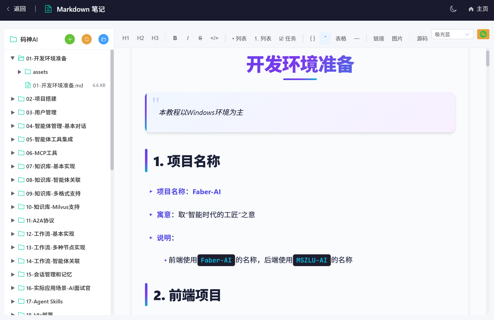
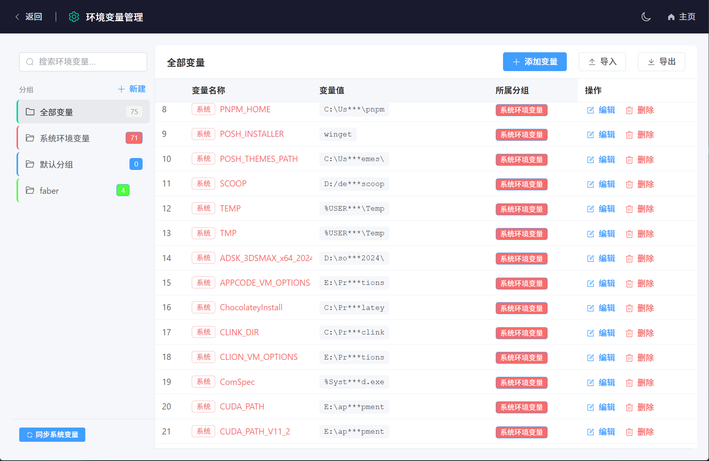
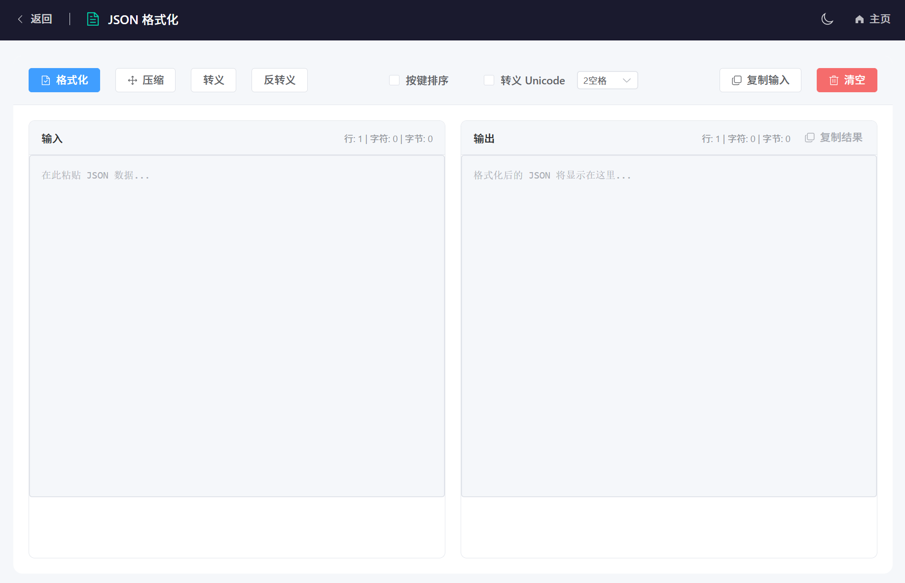
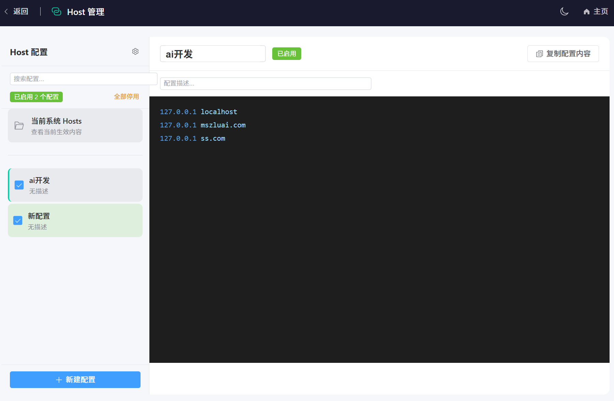
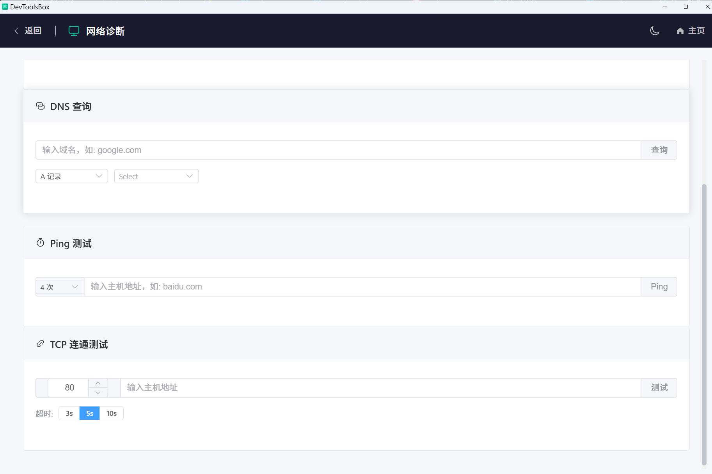
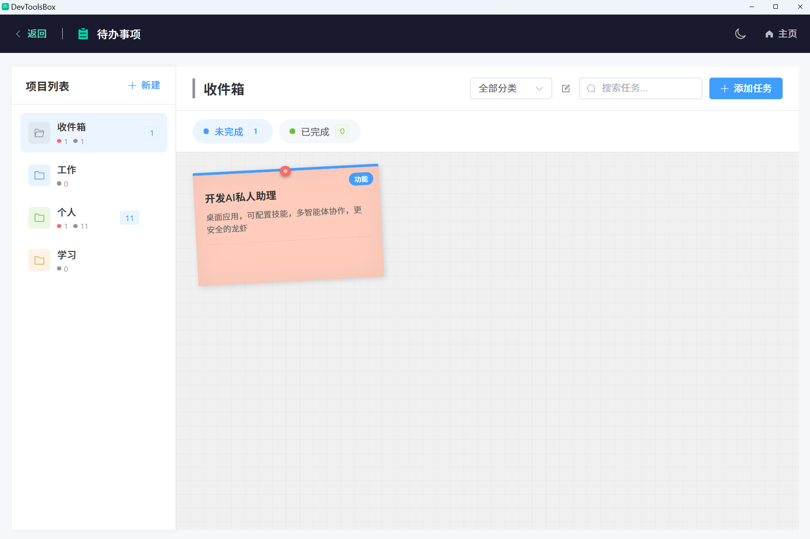

<div align="center">

# 🔧 DevTools Box

一个基于 **Electron + Vue3 + TypeScript + Vite** 开发的跨平台开发者工具箱。

[](https://opensource.org/licenses/MIT)
[](https://vuejs.org/)
[](https://www.electronjs.org/)
[](https://www.typescriptlang.org/)

## 📸 应用截图

### 🏠 主界面
简洁美观的工具导航主页，支持深色/浅色主题切换



---

## ✨ 功能特性

### 📝 Markdown 笔记
功能强大的 Markdown 编辑器，支持所见即所得编辑体验



**核心功能：**
- **所见即所得编辑器**：基于 TipTap + CodeMirror 的双模式编辑
- **文件树管理**：目录浏览、文件新建/重命名/删除
- **多主题预览**：支持多种精美主题风格
- **代码高亮**：集成 highlight.js，支持多种编程语言
- **自动保存**：实时自动保存编辑内容
- **工具栏**：支持标题、列表、表格、链接、图片等快捷操作

---

### 🌍 环境变量管理
直观的系统环境变量管理工具



**核心功能：**
- **分组管理**：自定义分组，分类管理环境变量
- **快速搜索**：按名称和值搜索环境变量
- **系统同步**：自动同步 Windows 系统环境变量
- **完整 CRUD**：增删改查一站式管理
- **导入导出**：支持数据备份和恢复
- **变量值脱敏**：保护敏感信息安全显示

---

### 📋 JSON 格式化
专业的 JSON 数据处理工具



**核心功能：**
- **格式化/压缩**：一键美化或压缩 JSON 数据
- **转义/反转义**：处理特殊字符转义
- **按键排序**：自动按键名排序
- **Unicode 转义**：支持 Unicode 字符处理
- **缩进设置**：2/4 空格缩进可选
- **实时统计**：显示行数、字符数、字节数
- **一键复制**：快速复制输入/输出内容

---

### 🌐 Host 管理
高效的 Hosts 文件管理方案



**核心功能：**
- **多配置方案**：支持创建多个 Host 配置
- **一键切换**：快速启用/停用配置
- **批量管理**：全部启用/全部停用
- **实时预览**：查看当前系统 Hosts 内容
- **配置描述**：为每个配置添加说明
- **系统集成**：直接修改系统 Hosts 文件

---

### 🛠️ 网络诊断
实用的网络工具集合



**核心功能：**
- **DNS 查询**：支持 A、AAAA、CNAME、MX、TXT 等记录查询
- **Ping 测试**：自定义次数的 Ping 测试
- **TCP 连通测试**：指定端口连通性检测
- **超时设置**：3s/5s/10s 多种超时选项
- **实时结果**：即时显示测试结果

---

### 📌 待办事项
优雅的番茄工作法任务管理



**核心功能：**
- **项目管理**：多项目分类管理任务
- **优先级设置**：高/中/低优先级标记
- **任务卡片**：便签式任务展示
- **搜索筛选**：快速查找任务
- **完成状态**：清晰区分已完成/未完成任务
- **数据持久化**：本地存储，重启不丢失

---

## 📦 技术栈

| 技术 | 说明 |
|------|------|
| [Electron](https://www.electronjs.org/) | 跨平台桌面应用框架 |
| [Vue 3](https://vuejs.org/) | 渐进式 JavaScript 框架 |
| [TypeScript](https://www.typescriptlang.org/) | 类型安全的 JavaScript 超集 |
| [Vite](https://vitejs.dev/) | 下一代前端构建工具 |
| [Element Plus](https://element-plus.org/) | Vue 3 组件库 |
| [Pinia](https://pinia.vuejs.org/) | Vue 状态管理 |
| [Vue Router](https://router.vuejs.org/) | Vue 路由管理 |
| [TipTap](https://tiptap.dev/) | 所见即所得编辑器框架 |
| [CodeMirror 6](https://codemirror.net/) | 代码编辑器组件 |
| [Markdown It](https://markdown-it.github.io/) | Markdown 解析器 |
| [highlight.js](https://highlightjs.org/) | 代码语法高亮 |

## 🚀 快速开始

### 环境要求

- [Node.js](https://nodejs.org/) 18+
- [pnpm](https://pnpm.io/) 8+ (推荐)

### 安装依赖

```bash
pnpm install
```

### 开发模式

```bash
pnpm dev
```

### 构建应用

```bash
# 构建所有平台
pnpm build

# 仅构建 Windows 版本
pnpm build:win

# 构建 macOS 版本
pnpm build:mac

# 构建 Linux 版本
pnpm build:linux
```

## 🖥️ 系统支持

| 平台 | 支持状态 |
|------|----------|
| Windows 10/11 | ✅ 完全支持 |
| macOS | ✅ 完全支持 |
| Linux | ✅ 完全支持 |

## 🤝 贡献指南

我们欢迎所有形式的贡献！如果您想为项目做出贡献，请：

1. Fork 本仓库
2. 创建您的特性分支 (`git checkout -b feature/AmazingFeature`)
3. 提交您的更改 (`git commit -m 'Add some AmazingFeature'`)
4. 推送到分支 (`git push origin feature/AmazingFeature`)
5. 打开一个 Pull Request

---

## 📄 开源协议

本项目基于 [MIT](LICENSE) 协议开源。

---

## 🙏 鸣谢

- [Vue.js](https://vuejs.org/)
- [Electron](https://www.electronjs.org/)
- [Element Plus](https://element-plus.org/)
- [Vite](https://vitejs.dev/)
- [TipTap](https://tiptap.dev/)
- [CodeMirror](https://codemirror.net/)
- [highlight.js](https://highlightjs.org/)

---

<div align="center">

**Star 🌟 这个项目，如果它对你有帮助！**

Made with ❤️ by [mszlu.com](https://mszlu.com)

